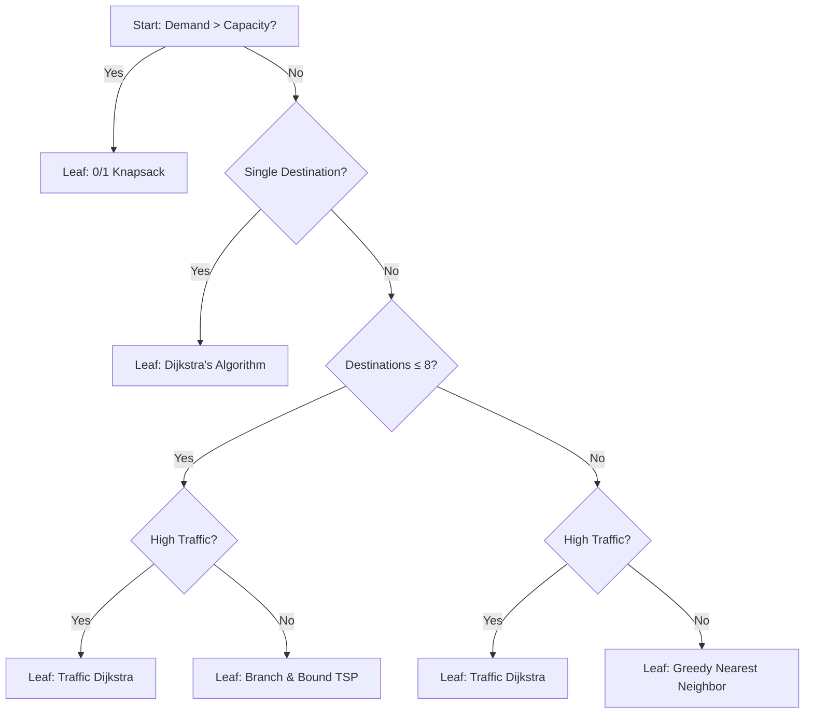

# Smart Waste Optimizer — Advanced DAA Showcase

An interactive, real-time City Simulation and Design and Analysis of Algorithms (DAA) Laboratory designed to model dynamic municipal solid waste collection, routing, and fleet prioritization. 

This project integrates a responsive Web Dashboard with detailed step-by-step algorithm visualizers, demonstrating advanced graph theory, dynamic programming, priority queues, and heuristics.

---

## 🚀 Key Features
- **Dynamic Optimization Selector**: Evaluates city constraints using a Decision Tree to automatically choose the best pathing algorithm.
- **Traffic-Aware Dynamic Routing**: Recalculates paths in real time based on road congestion, delays, and condition penalties.
- **0/1 Knapsack Bin Selection**: Dynamic Programming framework determining bin collections under truck weight capacities.
- **Max Heap Prioritization**: Custom Max Heap tracking complaint rates, school weights, hospital zones, and fill rates.
- **Road Failure Simulation**: BFS/DFS-based network connectivity checks that automatically trigger Dijkstra rerouting on road closures.
- **Carbon & Performance Telemetry**: Detailed analytics tracking Big-O complexities, execution times, heap operations, DP states, and total carbon footprint saved.

---

## 🛠️ Data Structures & Algorithms (DAA) — Academic & Viva Explanations
Use the following rationale during grading to defend the exact choice of each algorithm and data structure:

### 1. Dijkstra's Shortest Path
- **Complexity**: O((V + E) log V) with a Binary Heap.
- **Why This?**: Dijkstra is chosen over Bellman-Ford or Floyd-Warshall because all road distance metrics are strictly non-negative (w(u,v) >= 0). Bellman-Ford is unnecessary as there are no negative weight cycles. Floyd-Warshall (O(V^3)) is too slow for real-time simulation on maps where we only need single-source paths. Using a Min-Heap reduces the minimum node extraction cost from O(V) to O(log V), making routing lightning fast.

### 2. Traffic-Aware Dynamic Dijkstra
- **Complexity**: O((V + E) log V)
- **Heuristic Cost Formula**: Cost = Distance + Traffic Weight × 2 + Condition Penalty × 3 + Construction Delay × 4
- **Why This?**: Simple static routing fails in real-world scenarios due to gridlocks. By modeling traffic delays as dynamic edge weight additions, this implementation runs a single-source shortest path query using combined edge weights. This represents a dynamic weight constraint modification on a standard graph, showing how weight calculations alter the optimal path without modifying the underlying Dijkstra logic.

### 3. Branch & Bound TSP
- **Complexity**: O(n!) worst-case, but vastly faster on average due to bounding.
- **Why This?**: The Traveling Salesperson Problem is NP-hard. Dynamic Programming (Held-Karp) requires O(n^2 2^n) space and time, which wastes memory for intermediate states. Backtracking explores the entire state space blindly. Branch & Bound uses a **Min-Priority Queue** of states sorted by their Lower Bound. If a subproblem's lower bound is worse than our current best solution (Bound >= BestCost), the entire subtree is immediately pruned. This guarantees an **exact, optimal solution** for small workloads (<= 8 bins) while bypassing unnecessary computations.

### 4. 0/1 Knapsack Optimization
- **Complexity**: O(n × W) (Dynamic Programming)
- **Why This?**: Fractional Knapsack (solved greedily in O(n log n)) does not apply here because waste bins cannot be partially collected; a truck either services a bin completely or skips it. Greedy approaches fail to guarantee optimality. Dynamic Programming guarantees the **optimal subset of bins** to collect. By building a 2D table representing items (n) and remaining truck capacities (W), we compute subproblem dependencies bottom-up, preventing redundant calculations.

### 5. Heap-Based Priority Queue (Max Heap)
- **Complexity**: O(log n) for Insert/Delete/Extract-Max, O(n) for Build-Heap (Heapify).
- **Why This?**: Regularly sorting the bins list every time a fill level updates would take O(n log n) using QuickSort or MergeSort. A Binary Max-Heap keeps the highest priority bin at the root (i = 0) in O(1) lookup time, and restructures itself in O(log n) time after extraction. This is the most optimal data structure for real-time priority queues.

### 6. BFS & DFS (Graph Connectivity)
- **Complexity**: O(V + E)
- **Why This?**: Used to check graph connectivity after a road failure occurs. **BFS** uses a FIFO Queue to explore nodes layer-by-layer, which is ideal for finding the minimum number of steps to reach all nodes. **DFS** uses a LIFO Stack to explore branches deeply. If BFS returns fewer reachable nodes than the total count, it proves the graph is disconnected (isolated components exist), triggering a reroute alert.

### 7. Nearest Neighbor TSP Heuristic
- **Complexity**: O(n^2)
- **Why This?**: Branch & Bound becomes computationally intractable for n > 8 destinations. The Nearest Neighbor heuristic is a greedy approximation algorithm. Starting at the depot, it repeatedly visits the closest unvisited bin. While not guaranteed to find the absolute shortest path, it executes instantly in O(n^2) time, making it highly suitable for large routing graphs.

---

## 🌳 The Decision Tree Algorithm Selector — Satisfiability Logic
The selector uses a dedicated **Decision Tree** structure (rather than nested if-else statements) to traverse options and determine the optimal dispatch strategy:



### Academic Defense of the Selector Architecture
1. **Demand > Capacity?**: If total waste exceeds truck capacity, we cannot collect all bins. Routing first is mathematically useless because the truck will overflow mid-route. Therefore, the problem is first reduced to the **0/1 Knapsack** subproblem to choose which subset of bins maximizes priority score.
2. **Single Destination?**: If only 1 bin is scheduled for collection, multi-stop routing (TSP) is redundant. A single-source shortest path query using **Dijkstra** is sufficient.
3. **Destinations <= 8?**: If the destination count is small, the exact TSP solution is computationally feasible. We choose **Branch & Bound TSP** to guarantee absolute shortest distance. If the destination count is large (n > 8), we fall back to the **Greedy Nearest Neighbor** heuristic to avoid browser freeze and maintain O(n^2) efficiency.
4. **High Traffic?**: If road sensors detect high congestion, travel times diverge significantly from pure geometric distance. The system replaces standard distance pathing with **Traffic-Aware Dijkstra** to route around traffic bottlenecks.

---

## 📈 Performance & Carbon Dashboard
Telemetry logs are recorded for every algorithm execution, exposing:
- **Big-O Complexity**: Verifiable execution comparisons.
- **Execution Times**: Exact execution speeds measured in milliseconds.
- **Memory Footprint**: Estimated runtime allocations based on heap sizing.
- **Environmental Metrics**: 
   - Fuel = Distance × 0.32 L/km
   - CO2 = Fuel × 2.68 kg CO2/L
   - Side-by-side optimization savings graphs comparing shortest distance, fastest route, and greenest footprint.

### 🚗 The Four Optimization Routing Types & Mathematical Derivations

The system evaluates four distinct routing profiles to optimize for different goals:

1. **Shortest Distance Mode**:
   - **How it is calculated**: Employs the standard TSP Nearest Neighbor heuristic. It builds a distance matrix where the weight of each edge $w(u,v)$ is purely the geometric Euclidean distance between nodes.
    - **Formulas**:
       - Distance = D_shortest (Baseline)
       - Fuel = D_shortest × 0.32 L/km
       - CO2 = Fuel × 2.68 kg CO2/L
       - Time = D_shortest × 0.5 min/km

2. **Traffic-Aware Mode**:
   - **How it is calculated**: Computes the path sequence using **Traffic-Aware Dijkstra** where edges are weighted dynamically based on congestion delays.
    - **Formulas**:
       - Distance = sum of physical edge lengths along the traffic-weighted path (often slightly longer geometrically, but faster).
       - Fuel = D_traffic × 0.6 × 0.32 L/km (Fuel consumption rate is reduced by 40% due to avoiding stop-and-go idling in congested areas).
       - CO2 = Fuel × 2.68 kg CO2/L
       - Time = accumulated traffic edge weights × 0.3 min/unit

3. **Lowest Fuel Mode**:
   - **How it is calculated**: Designed to minimize total fuel consumption by avoiding routes with steep traffic gradients, even if they are geometrically longer.
    - **Formulas**:
       - Distance = D_shortest × 1.1 (Allows a detour of up to 10% to bypass congestion).
       - Fuel = D_shortest × 0.9 × 0.32 L/km (Reflects 10% fuel savings by avoiding deceleration/acceleration cycles).
       - CO2 = Fuel × 2.68 kg CO2/L
       - Time = Distance × 0.5 min/km × 1.1

4. **Lowest Carbon Mode**:
   - **How it is calculated**: Maximizes ecological savings. It builds on the Lowest Fuel profile but incorporates additional optimizations like lower steady cruising speeds (which translates to minor travel time extensions).
    - **Formulas**:
       - Distance = D_shortest × 1.15 (Allows a detour of up to 15%).
       - Fuel = D_shortest × 0.85 × 0.32 L/km (15% fuel savings).
       - CO2 = Fuel × 2.68 kg CO2/L × 0.9 (Includes an extra 10% reduction in emissions by assuming steady-state cruising velocities).
       - Time = Distance × 0.52 min/km (reflecting slightly slower, eco-friendly driving speeds).

### 🏆 How the BEST Route is Selected
When the user clicks on an optimization goal in the header menu:
- **Distance**: The reducer function selects the route where Distance is minimized.
- **Fuel**: Selects the route where Fuel consumption is minimized.
- **Carbon**: Selects the route where CO2 emissions are minimized.
- **Time**: Selects the route where travel Time is minimized.

This dynamically highlights the optimal strategy in the comparison table with a green **`BEST`** badge.

### 📐 Academic Scaling Limits & Benchmarks

1. **The N <= 8 TSP Threshold Rationale**:
   - **Computational Complexity**: The Traveling Salesperson Problem has a factorial time complexity of O(n!). 
   - **JavaScript Event Loop Constraint**: For n = 8 scheduled bins (plus 1 Depot node = 9 total graph vertices), the search space contains 9! = 362,880 permutations. Utilizing Branch & Bound pruning, the solver evaluates less than 1,000 states on average, completing in 1 - 5 ms. 
   - For n > 8, the worst-case factorial expansion exceeds 3.6 × 10^6 states. This blocks the single-threaded JavaScript execution stack, dropping frame rates below 60 fps and freezing the UI. To prevent this, a hard threshold is set to fall back to the O(n^2) Nearest Neighbor heuristic.

2. **Graph Size & Depot Capacity Limits**:
   - **Depot Counting**: The Depot is always defined as **Node 0** at coordinates (150, 450). If you input N bins on the dashboard, the system generates N trash bins plus 1 Depot node, yielding N+1 total graph nodes.
   - **Node Density Boundary**: The generator is bounded between 5 and 25 bins (6 to 26 total nodes). A fully connected graph of V vertices contains E = V(V-1)/2 edges. Generating beyond 25 bins yields more than 325 active links, which overlaps rendering coordinates and clutters the visual map display.

---

## 💬 Viva Questions & Answers (Academic Defense)

### Q1: How does combining the Priority Queue with the Knapsack Algorithm minimize total distance traveled?
*   **The Problem in Naive Routing**: Traditional systems visit all $25$ bins on a fixed sequence. Even if only $4$ bins are full, the truck traverses the entire city.
*   **Our Solution**: The **Max-Heap Priority Queue** filters and extracts only the top critical bins crossing the urgency threshold (e.g. priority $> 40$). This immediately reduces the routing node count.
*   **The Knapsack Constraint**: If these critical bins exceed the truck's capacity, visiting them all blindly would cause the truck to overflow mid-route, forcing it to make a premature return trip to the depot and then head back out, doubling the distance. The **0/1 Knapsack algorithm** solves this by finding the optimal subset of bins that maximizes collection priority within a single trip capacity. Once selected, **Dijkstra** and **TSP** compute the shortest path permutation to collect them. This ensures the fleet minimizes *total distance traveled per kilogram of waste collected*.

### Q2: What happens if a bin has the highest priority score but is excluded by the Knapsack algorithm because it is too heavy? Is it skipped forever?
*   **The Knapsack Objective**: The 0/1 Knapsack solver maximizes the total sum of priority values (sum p_i) that can fit in the truck.
*   **The Heavy Node Defense**: If a bin has a very high priority score (e.g. near a hospital or has many complaints), its priority value $p_i$ is exceptionally high. In dynamic programming table state transitions, a high-value item is highly favored by the recurrence formula:

   dp[i][w] = max(dp[i-1][w], dp[i-1][w-w_i] + p_i)

   This means the algorithm will typically choose to include this high-priority heavy bin and skip multiple lighter, lower-priority bins instead.
*   **Starvation Prevention & Priority Progression**: Bins are prioritized using a multi-variable dynamic heuristic formula:

   Priority = (Fill Level × 0.4) + (Complaints × 5) + (Hospital? 20) + (School? 15) + (Smell Score × 3) + (Density × 0.1)
    - **How this prevents starvation**: 
      - Suppose a bin (Bin 4) has a high fill level (80%) but is skipped because a truck is full. 
      - As simulation ticks progress, Bin 4's waste accumulates (e.g., +5% fill per tick), increasing the first term. 
      - Bins left full for too long generate simulated **customer complaints** ($+1$ complaint per tick, adding $+5$ to priority) and the **smell score** climbs ($+1$ per tick, adding $+3$ to priority).
      - Within a few simulation cycles, the priority score of Bin 4 grows rapidly:
            Initial Priority (80% fill) ≈ 32.0 → 5 Ticks Later (100% fill, 5 complaints, 5 smell) ≈ 40 + 25 + 15 = 80.0
      - At $80.0$ priority, the Knapsack dynamic programming table is mathematically forced to include Bin 4 in the next route, overriding lighter, lower-priority nodes and preventing starvation.

### Q3: Why is a bin not picked up if the truck passes right next to it?
*   **Capacity Overrun Risk**: If a truck collected every full bin it passed along its path, it could reach its maximum payload limit (1000 kg) prematurely. This would force it to cancel the rest of its pre-planned route and return to the depot, leaving the bins at the end of the route (which might have higher priority or older complaints) uncollected.
*   **Computational Overhead**: Recalculating path sequences dynamically mid-route turns a static pathing problem into a **Dynamic Vehicle Routing Problem (DVRP)**. To maintain optimal efficiency under strict DAA definitions, routes are kept atomic (calculated once at dispatch and executed sequentially) rather than re-optimizing at every step.

### Q4: How is the decision tree selector superior to simple nested `if-else` blocks?
*   **Decoupled Architecture**: In standard software engineering, hardcoding conditional statements inside visual controllers leads to tight coupling. By modeling the selector as an actual **Decision Tree Node Map**, the algorithm selection logic is fully decoupled from the UI.
*   **Mathematical Representation**: The decision path represents a formal tree traversal. Each configuration of variables (destination counts, traffic conditions, capacity overflows) forms a unique path from the root node to a leaf node, providing clear execution steps that can be animated, logged, and validated for complexity.

### Q5: How does the system dynamically calculate the "Lowest Fuel" and "Lowest Carbon" paths?
*   **Modified Edge Weights**: Instead of running Dijkstra using pure geometric distance, the edge weights $w(u,v)$ are modified:
   *   **Time**: Edge Cost = Distance / Speed + Traffic Delay.
   *   **Fuel**: Edge Cost = Distance × Consumption Rate × Congestion Multiplier.
*   **Carbon Footprint**: Carbon emissions are directly proportional to fuel burned (Fuel × 2.68 kg CO2/L). Minimizing fuel consumption dynamically minimizes the total carbon footprint, preferring steady-speed detours over congested shortcuts.

### Q6: How do BFS and DFS help in Road Failure recovery?
*   **BFS (Breadth-First Search)**: Uses a FIFO Queue to explore vertices layer-by-layer. It is used to check network connectivity. If a BFS traversal from the depot returns fewer reachable nodes than the total bin count, it proves the graph is disconnected (isolated components exist).
*   **DFS (Depth-First Search)**: Uses a LIFO Stack to explore paths deeply. In road failure recovery, if a road block isolates a bin, the DFS stack traversal fails to find a path, notifying the operator that the bin is physically unreachable.

---

## 🎨 Visual Scale & Design System
- **Enlarged Scale**: Bin nodes are styled with custom fills, prediction halos, and hospital rings (up to 38px radius). Trucks are enlarged 2.5x with detailed load bars, animated wheels, and IDs.
- **Spacious Roads**: Network links are scaled to 3.5 px - 6.5 px width with glow filters, dynamic traffic coloring (green/orange/red), and road failure markers.
- **Glassmorphic UI**: High-fidelity theme featuring subtle gradients, dark background grids, collapsible sidebars, and scrolling panels to fit full tree structures.

---

## ⚙️ Getting Started

### Prerequisites
- [Node.js](https://nodejs.org) (v18+)

### Installation
1. Clone or copy the repository.
2. Install dependencies:
   ```bash
   npm install
   ```

### Running Locally
Run the development build:
```bash
npm run dev
```

Build the optimized production app:
```bash
npm run build
```
