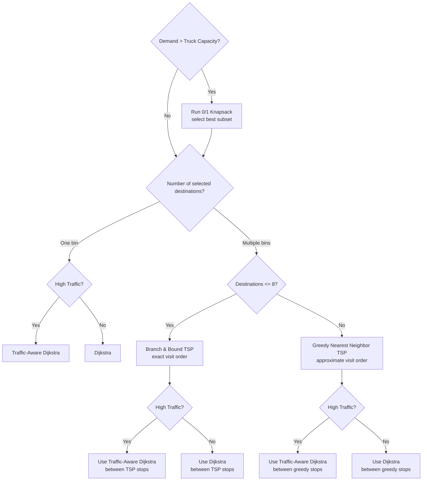

# Smart Waste Optimizer — Advanced DAA Showcase

An interactive, real-time City Simulation and Design and Analysis of Algorithms (DAA) Laboratory designed to model dynamic municipal solid waste collection, routing, and fleet prioritization. 

This project integrates a responsive Web Dashboard with detailed step-by-step algorithm visualizers, demonstrating advanced graph theory, dynamic programming, priority queues, and heuristics.

---

## 🚀 Key Features
- **Dynamic Optimization Selector**: Evaluates city constraints using a Decision Tree to automatically choose the best pathing algorithm.
- **Traffic-Aware Dynamic Routing**: Recalculates paths in real time based on road congestion, delays, and condition penalties.
- **0/1 Knapsack Bin Selection**: Dynamic Programming framework determining bin collections under truck weight capacities.
- **Max Heap Prioritization**: Custom Max Heap tracking complaint rates, school weights, hospital zones, and fill rates.
- **Road Failure Simulation**: BFS/DFS-based network connectivity checks that automatically trigger Dijkstra rerouting on road closures.
- **Carbon & Performance Telemetry**: Detailed analytics tracking Big-O complexities, execution times, heap operations, DP states, and total carbon footprint saved.

---

## 🛠️ Data Structures & Algorithms (DAA) — Academic & Viva Explanations
Use the following rationale during grading to defend the exact choice of each algorithm and data structure:

### 1. Dijkstra's Shortest Path
- **Complexity**: O((V + E) log V) with a Binary Heap.
- **Why This?**: Dijkstra is chosen over Bellman-Ford or Floyd-Warshall because all road distance metrics are non-negative, meaning w(u,v) >= 0. Bellman-Ford is unnecessary because there are no negative weight cycles. Floyd-Warshall, O(V^3), is too slow for real-time simulation because the project only needs single-source paths. A Min-Heap reduces minimum-node extraction from O(V) to O(log V).

### 2. Traffic-Aware Dynamic Dijkstra
- **Complexity**: O((V + E) log V)
- **Heuristic Cost Formula**: Cost = Distance + Traffic Weight * 2 + Condition Penalty * 3 + Construction Delay * 4
- **Why This?**: Simple static routing fails in real-world scenarios due to gridlocks. By modeling traffic delays as dynamic edge weight additions, this implementation runs a single-source shortest path query using combined edge weights. This represents a dynamic weight constraint modification on a standard graph, showing how weight calculations alter the optimal path without modifying the underlying Dijkstra logic.

### 3. Branch & Bound TSP
- **Complexity**: O(n!) worst-case, but vastly faster on average due to bounding.
- **Why This?**: The Traveling Salesperson Problem is NP-hard. Dynamic Programming with Held-Karp requires O(n^2 * 2^n) space and time, which wastes memory for this visual workload. Backtracking explores the entire state space blindly. Branch & Bound uses a Min-Priority Queue of states sorted by lower bound. If a subproblem's lower bound is worse than the current best solution, meaning Bound >= BestCost, the entire subtree is pruned. This gives an exact solution for small workloads, up to 8 bins.

### 4. 0/1 Knapsack Optimization
- **Complexity**: O(n * W) using Dynamic Programming.
- **Why This?**: Fractional Knapsack, solved greedily in O(n log n), does not apply because waste bins cannot be partially collected. A truck either services a bin completely or skips it. Dynamic Programming guarantees the optimal subset of bins by building a 2D table over items n and truck capacity W.

### 5. Heap-Based Priority Queue (Max Heap)
- **Complexity**: O(log n) for Insert/Delete/Extract-Max, and O(n) for Build-Heap.
- **Why This?**: Sorting the bins list every time a fill level updates would take O(n log n). A Binary Max-Heap keeps the highest-priority bin at the root, index i = 0, in O(1) lookup time and restructures itself in O(log n) after extraction.

### 6. BFS & DFS (Graph Connectivity)
- **Complexity**: O(V + E)
- **Are both used?**: Both BFS and DFS are implemented in the graph traversal module. In the current Road Failure page, BFS is the primary active connectivity check after a road is blocked. DFS is included as the alternate traversal strategy and is useful for demonstrating deep component exploration.
- **Why BFS?**: BFS uses a FIFO Queue and explores the road network level by level from the depot. If BFS reaches fewer nodes than the total city graph, the graph is disconnected and a reroute warning is shown.
- **Why DFS?**: DFS uses a LIFO Stack and explores one branch deeply before backtracking. It is useful for verifying reachability/component behavior and for explaining how isolated graph regions can be detected using a different traversal order.
- **Viva Defense**: BFS and DFS have the same O(V + E) complexity, but they demonstrate different data structures and traversal behavior. BFS is better for the active connectivity check, while DFS is kept to show depth-first component exploration and to compare traversal strategies.

### 7. Nearest Neighbor TSP Heuristic
- **Complexity**: O(n^2)
- **Why This?**: Branch & Bound becomes computationally intractable for n > 8 destinations. The Nearest Neighbor heuristic is a greedy approximation algorithm. Starting at the depot, it repeatedly visits the closest unvisited bin. It is not guaranteed to find the absolute shortest path, but it executes quickly in O(n^2), making it suitable for large routing graphs.

---

## Actual Dispatch Flow and Decision Tree Logic
The project does **not** solve a full multi-vehicle Vehicle Routing Problem (VRP). It uses a practical dispatch pipeline:

1. Calculate bin priority.
2. Use a Max Heap to keep urgent bins first.
3. Filter low-priority bins.
4. Assign a small batch of candidate bins to each available truck.
5. If the batch is too heavy, run 0/1 Knapsack to select the best subset.
6. If one destination remains, use Dijkstra.
7. If multiple destinations remain, use TSP to decide visit order.
8. Use normal Dijkstra or Traffic-Aware Dijkstra to drive between each pair of stops.

### Step-by-Step Example
Suppose the city has **3 trucks**, **20 bins**, and **1 depot**. Initially all trucks are empty and parked at the depot.

Every simulation tick, each bin gets a dynamic priority score:

| Bin | Fill | Complaints | Hospital? | Priority |
| --- | ---: | ---: | :---: | ---: |
| B1 | 90% | 3 | No | 82 |
| B2 | 45% | 0 | No | 20 |
| B3 | 70% | 5 | Yes | 98 |
| B4 | 85% | 1 | No | 63 |
| B5 | 20% | 0 | No | 8 |

The Max Heap keeps the highest-priority bins at the top. So instead of processing bins randomly, the system sees the urgent order first:

```text
B3 -> B1 -> B4 -> B2 -> B5
```

Low-priority bins are ignored for the current dispatch. For example, if the threshold is `Priority > 40`, only bins like `B3`, `B1`, `B4`, `B7`, `B8`, and `B10` become candidate bins.

These candidates are assigned in small batches to available trucks. If a truck receives bins whose total waste exceeds its capacity, the project runs **0/1 Knapsack** before routing.

Example for Truck 1:

| Bin | Waste | Priority |
| --- | ---: | ---: |
| B3 | 40 kg | 90 |
| B1 | 35 kg | 80 |
| B4 | 30 kg | 50 |
| B7 | 25 kg | 30 |

If truck capacity is `100 kg`, total demand is `130 kg`, so the truck cannot collect everything. Knapsack asks:

> Which combination gives the highest total priority while staying under 100 kg?

It may choose `B3 + B1 + B7`, exactly `100 kg`, and skip `B4` for this trip. Only after this selection does route planning begin.

### Correct Decision Tree
The decision tree is a selector for **what problem must be solved next**:



### Why Traffic Does Not Replace TSP
There are two different questions:

| Problem | Question | Algorithm |
| --- | --- | --- |
| Visit order | Which bin should the truck visit first, second, third? | TSP |
| Road path | Which road should the truck take from one stop to the next? | Dijkstra |

If TSP decides:

```text
Depot -> B4 -> B7 -> B3 -> Depot
```

then Dijkstra is used for each segment:

```text
Depot -> B4
B4 -> B7
B7 -> B3
B3 -> Depot
```

When traffic is normal, those segments use normal Dijkstra with physical distance as the edge cost. When traffic is high, those same segments use **Traffic-Aware Dijkstra**:

```text
edge cost = distance + trafficWeight * 2 + roadCondition * 3 + constructionDelay * 4
```

So traffic does **not** decide the bin order by itself. It changes the edge weights used to find the best road between two already chosen stops.

In the TSP visualizer, the **High Traffic** toggle controls this directly:

- **Off**: the TSP distance matrix is built with normal Dijkstra using road distance.
- **On**: the TSP distance matrix is built with Traffic-Aware Dijkstra using congestion, road condition, and construction delay.

That means high traffic can change both the displayed path between stops and the final TSP/Greedy route cost because the graph weights are different.

### Academic Defense of the Selector Architecture
1. **Demand > Capacity?**: Routing bins the truck cannot carry is invalid. Knapsack first reduces the batch to the highest-priority subset that fits.
2. **Single Destination?**: With one bin, there is no ordering problem. Dijkstra is enough.
3. **Multiple Destinations?**: With more than one bin, the truck needs a visit order, so TSP is required.
4. **Destinations <= 8?**: Small TSP instances use exact Branch & Bound. Larger instances use Greedy Nearest Neighbor to avoid UI freeze.
5. **High Traffic?**: Traffic changes the shortest-path edge cost between stops. It selects Traffic-Aware Dijkstra for segment routing; it does not remove the TSP step.

---

## 📈 Performance & Carbon Dashboard
Telemetry logs are recorded for every algorithm execution, exposing:
- **Big-O Complexity**: Verifiable execution comparisons.
- **Execution Times**: Exact execution speeds measured in milliseconds.
- **Memory Footprint**: Estimated runtime allocations based on heap sizing.
- **Environmental Metrics**: 
  - Fuel = Distance * 0.32 L/km
  - CO2 = Fuel * 2.68 kg CO2/L
  - Side-by-side optimization savings graphs comparing shortest distance, fastest route, and greenest footprint.

### 🚗 The Four Optimization Routing Types & Mathematical Derivations

The system evaluates four distinct routing profiles to optimize for different goals:

1. **Shortest Distance Mode**:
   - **How it is calculated**: Employs the standard TSP Nearest Neighbor heuristic. It builds a distance matrix where the weight of each edge w(u,v) is purely the geometric Euclidean distance between nodes.
   - **Formulas**:
     - Distance = D_shortest (baseline)
     - Fuel = D_shortest * 0.32 L/km
     - CO2 = Fuel * 2.68 kg CO2/L
     - Time = D_shortest * 0.5 min/km

2. **Traffic-Aware Mode**:
   - **How it is calculated**: Computes the path sequence using **Traffic-Aware Dijkstra** where edges are weighted dynamically based on congestion delays.
   - **Formulas**:
     - Distance = sum of physical edge lengths along the traffic-weighted path. This can be geometrically longer but faster.
     - Fuel = D_traffic * 0.6 * 0.32 L/km. The 0.6 multiplier models reduced stop-and-go fuel waste.
     - CO2 = Fuel * 2.68 kg CO2/L
     - Time = Accumulated Traffic Edge Weights * 0.3 min/unit

3. **Lowest Fuel Mode**:
   - **How it is calculated**: Designed to minimize total fuel consumption by avoiding routes with steep traffic gradients, even if they are geometrically longer.
   - **Formulas**:
     - Distance = D_shortest * 1.1. This allows a detour of up to 10% to bypass congestion.
     - Fuel = D_shortest * 0.9 * 0.32 L/km. This models 10% fuel savings by avoiding braking and acceleration cycles.
     - CO2 = Fuel * 2.68 kg CO2/L
     - Time = Distance * 0.5 min/km * 1.1

4. **Lowest Carbon Mode**:
   - **How it is calculated**: Maximizes ecological savings. It builds on the Lowest Fuel profile but incorporates additional optimizations like lower steady cruising speeds (which translates to minor travel time extensions).
   - **Formulas**:
     - Distance = D_shortest * 1.15. This allows a detour of up to 15%.
     - Fuel = D_shortest * 0.85 * 0.32 L/km. This models 15% fuel savings.
     - CO2 = Fuel * 2.68 kg CO2/L * 0.9. The 0.9 multiplier models an extra 10% emission reduction from steadier driving.
     - Time = Distance * 0.52 min/km, reflecting slightly slower eco-friendly driving.

### 🏆 How the BEST Route is Selected
When the user clicks on an optimization goal in the header menu:
- **Distance**: The reducer function selects the route where Distance is minimized.
- **Fuel**: Selects the route where Fuel consumption is minimized.
- **Carbon**: Selects the route where CO2 emissions are minimized.
- **Time**: Selects the route where travel Time is minimized.

This dynamically highlights the optimal strategy in the comparison table with a green **`BEST`** badge.

### 📐 Academic Scaling Limits & Benchmarks

1. **The N <= 8 TSP Threshold Rationale**:
   - **Computational Complexity**: The Traveling Salesperson Problem has factorial time complexity, O(n!).
   - **JavaScript Event Loop Constraint**: For n = 8 scheduled bins, plus 1 depot node, there are 9 total graph vertices. The full search space contains 9! = 362,880 permutations. With Branch & Bound pruning, the solver evaluates far fewer states and usually finishes in about 1 to 5 ms.
   - For n > 8, the worst-case factorial expansion exceeds 3.6 * 10^6 states. This can block the single-threaded JavaScript execution stack, drop frame rate below 60 fps, and freeze the UI. To prevent this, the project switches to the O(n^2) Nearest Neighbor heuristic.

2. **Graph Size & Depot Capacity Limits**:
   - **Depot Counting**: The Depot is always defined as **Node 0** at coordinates (150, 450). If you input N bins on the dashboard, the system generates N trash bins plus 1 Depot node, yielding N + 1 total graph nodes.
   - **Node Density Boundary**: The generator is bounded between **5 and 25 bins**, or 6 to 26 total nodes including the depot. A fully connected graph of V vertices contains E = V(V - 1) / 2 edges. Generating beyond 25 bins creates more than 325 active links, which overlaps rendering coordinates and clutters the visual map display.

---

## 💬 Viva Questions & Answers (Academic Defense)

### Q1: How does combining the Priority Queue with the Knapsack Algorithm minimize total distance traveled?
*   **The Problem in Naive Routing**: Traditional systems visit all 25 bins on a fixed sequence. Even if only 4 bins are full, the truck traverses the entire city.
*   **Our Solution**: The **Max-Heap Priority Queue** filters and extracts only the top critical bins crossing the urgency threshold, for example priority > 40. This immediately reduces the routing node count.
*   **The Knapsack Constraint**: If these critical bins exceed the truck's capacity, visiting them all blindly would cause the truck to overflow mid-route, forcing it to make a premature return trip to the depot and then head back out, doubling the distance. The **0/1 Knapsack algorithm** solves this by finding the optimal subset of bins that maximizes collection priority within a single trip capacity. Once selected, **Dijkstra** and **TSP** compute the shortest path permutation to collect them. This ensures the fleet minimizes *total distance traveled per kilogram of waste collected*.

### Q2: What happens if a bin has the highest priority score but is excluded by the Knapsack algorithm because it is too heavy? Is it skipped forever?
*   **The Knapsack Objective**: The 0/1 Knapsack solver maximizes the total sum of priority values that can fit in the truck.
*   **The Heavy Node Defense**: If a bin has a very high priority score, for example near a hospital or with many complaints, its priority value is high. In dynamic programming table transitions, a high-value item is favored by this recurrence:
    dp[i][w] = max(dp[i - 1][w], dp[i - 1][w - weight_i] + priority_i)
    This means the algorithm will typically choose to include this high-priority heavy bin and skip multiple lighter, lower-priority bins instead.
*   **Starvation Prevention & Priority Progression**: Bins are prioritized using a multi-variable dynamic heuristic formula:
    Priority = Fill Level * 0.4 + Complaints * 5 + Hospital Bonus + School Bonus + Smell Score * 3 + Density * 0.1
    - **How this prevents starvation**: 
      - Suppose a bin, Bin 4, has a high fill level of 80% but is skipped because a truck is full.
      - As simulation ticks progress, Bin 4's waste accumulates, for example +5% fill per tick, increasing the first term.
      - Bins left full for too long generate simulated **customer complaints**, +1 complaint per tick, adding +5 to priority. The **smell score** also climbs, adding +3 per smell point.
      - Within a few simulation cycles, the priority score of Bin 4 grows rapidly:
        Initial Priority at 80% fill is about 32.0. Five ticks later, with 100% fill, 5 complaints, and smell score 5, priority becomes about 40 + 25 + 15 = 80.0.
      - At 80.0 priority, the Knapsack table strongly favors Bin 4 in the next route, overriding lighter, lower-priority nodes and preventing starvation.

### Q3: Why is a bin not picked up if the truck passes right next to it?
*   **Capacity Overrun Risk**: If a truck collected every full bin it passed along its path, it could reach its maximum payload limit of 1000 kg prematurely. This would force it to cancel the rest of its pre-planned route and return to the depot, leaving the bins at the end of the route uncollected.
*   **Computational Overhead**: Recalculating path sequences dynamically mid-route turns a static pathing problem into a **Dynamic Vehicle Routing Problem (DVRP)**. To maintain optimal efficiency under strict DAA definitions, routes are kept atomic (calculated once at dispatch and executed sequentially) rather than re-optimizing at every step.

### Q4: How is the decision tree selector superior to simple nested `if-else` blocks?
*   **Decoupled Architecture**: In standard software engineering, hardcoding conditional statements inside visual controllers leads to tight coupling. By modeling the selector as an actual **Decision Tree Node Map**, the algorithm selection logic is fully decoupled from the UI.
*   **Mathematical Representation**: The decision path represents a formal tree traversal. Each configuration of variables (destination counts, traffic conditions, capacity overflows) forms a unique path from the root node to a leaf node, providing clear execution steps that can be animated, logged, and validated for complexity.

### Q5: How does the system dynamically calculate the "Lowest Fuel" and "Lowest Carbon" paths?
*   **Modified Edge Weights**: Instead of running Dijkstra using pure geometric distance, the edge weights w(u,v) are modified:
    *   **Time**: Edge Cost = Distance / Speed + Traffic Delay.
    *   **Fuel**: Edge Cost = Distance * Consumption Rate * Congestion Multiplier.
*   **Carbon Footprint**: Carbon emissions are directly proportional to fuel burned: Fuel * 2.68 kg CO2/L. Minimizing fuel consumption dynamically minimizes the total carbon footprint, preferring steady-speed detours over congested shortcuts.

### Q6: How do BFS and DFS help in Road Failure recovery?
*   **Are both implemented?** Yes. The project implements both BFS and DFS in the graph traversal module.
*   **Which one is actively used in the Road Failure page?** BFS is the primary active check after a road is blocked. It starts from the depot and checks how many nodes are still reachable.
*   **Why BFS for the active check?** BFS uses a FIFO Queue and explores level by level. This makes it easy to report reachability from the depot and detect disconnected components after a road failure.
*   **Why keep DFS?** DFS uses a LIFO Stack and explores deeply before backtracking. It is useful for demonstrating an alternate graph traversal strategy and explaining how isolated branches/components can also be discovered.
*   **Viva Defense**: BFS and DFS both run in O(V + E). The project includes both to compare queue-based and stack-based traversal. BFS is preferred for the live connectivity alert, while DFS supports academic comparison and deep component exploration.

---

## 🎨 Visual Scale & Design System
- **Enlarged Scale**: Bin nodes are styled with custom fills, prediction halos, and hospital rings (up to 38px radius). Trucks are enlarged 2.5x with detailed load bars, animated wheels, and IDs.
- **Spacious Roads**: Network links are scaled to 3.5px - 6.5px width with glow filters, dynamic traffic coloring (green/orange/red), and road failure markers.
- **Glassmorphic UI**: High-fidelity theme featuring subtle gradients, dark background grids, collapsible sidebars, and scrolling panels to fit full tree structures.

---

## ⚙️ Getting Started

### Prerequisites
- [Node.js](https://nodejs.org) (v18+)

### Installation
1. Clone or copy the repository.
2. Install dependencies:
   ```bash
   npm install
   ```

### Running Locally
Run the development build:
```bash
npm run dev
```

Build the optimized production app:
```bash
npm run build
```
